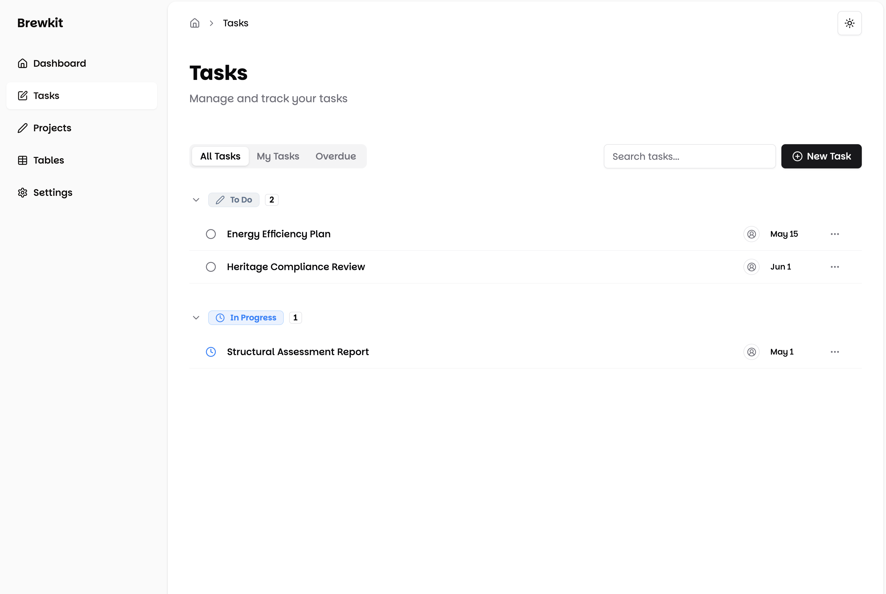

<div align="center">
  <h1>brewkit</h1>
  <p>A modern, type-safe Next.js boilerplate to quickly spin up a new project</p>

  <p>
    <a href="#features">Features</a> •
    <a href="#tech-stack">Tech Stack</a> •
    <a href="#getting-started">Getting Started</a> •
    <a href="#project-structure">Project Structure</a>
  </p>
</div>

## ✨ Features

- 🎯 **Type Safety** - Built with TypeScript for robust development
- 🎨 **Modern UI** - Styled with Tailwind CSS and Shadcn/ui components
- 📊 **Data Tables** - Ready to go `<DataTable />` component
- 🚀 **Next.js App Router** - Modern routing and server components
- 📱 **Responsive Design** - Mobile-first approach

## 🖼️ Preview

<div align="center">
  
  <p align="center"><em>As of Feburary 13th, 2025</em></p>
</div>

## 🛠️ Tech Stack

- Next.js 15 - React framework
- TypeScript - Language
- Shadcn/ui - UI Components
- Tailwind CSS - Styling
- TanStack Table - Table Management
- Zod - Schema Validation

## 🚀 Getting Started

First, clone and install dependencies:

```bash
git clone https://github.com/harrybaines/brewkit.git
cd brewkit

# Install dependencies
bun install

# Then, run the dev server:
bun dev
```

Open [http://localhost:3000](http://localhost:3000) in your browser.

## 📁 Project Structure

```
brewkit/
├── app/                    # Next.js app directory
│   ├── account/           # Account page
│   ├── projects/          # Projects page
│   ├── settings/          # Settings page
│   └── tables/            # Data table implementation
│       ├── columns.tsx    # Table column definitions
│       ├── page.tsx       # Table page component
│       └── types.ts       # Table type definitions
├── components/
│   ├── app-sidebar.tsx    # Main navigation sidebar
│   ├── breadcrumb.tsx     # Breadcrumb navigation
│   └── ui/               # Reusable UI components
│       └── data-table/   # Table component
├── hooks/
│   └── use-mobile.tsx    # Mobile detection hook
├── lib/
│   └── utils.ts         # Utility functions
├── public/
│   └── assets/         # Static assets and images
└── types/              # Global type definitions
```

## 💻 Data Table Example

```typescript
// Define schema with Zod
const paymentSchema = z.object({
  id: z.string(),
  amount: z.number(),
  status: z.enum(["pending", "processing", "success", "failed"]),
  email: z.string().email(),
});

// Create type-safe columns
const columns = [
  {
    accessorKey: "email",
    header: ({ column }) => (
      <DataTableColumnHeader column={column} title="Email" />
    ),
  },
  {
    accessorKey: "amount",
    header: ({ column }) => (
      <DataTableColumnHeader column={column} title="Amount" />
    ),
    cell: ({ row }) => (
      <DataTableCurrencyCell amount={row.getValue("amount")} />
    ),
  },
];
```

## 📚 Learn More

To learn more about the technologies used:

- [Next.js Documentation](https://nextjs.org/docs) - learn about Next.js features and API
- [TanStack Table Guide](https://tanstack.com/table/latest/docs/guide/introduction) - learn about table features
- [Shadcn/ui Components](https://ui.shadcn.com/docs) - explore available components
- [Tailwind CSS](https://tailwindcss.com/docs) - style your components

## 🚀 Deploy on Vercel

The easiest way to deploy your Next.js app is to use the [Vercel Platform](https://vercel.com/new?utm_medium=default-template&filter=next.js&utm_source=create-next-app&utm_campaign=create-next-app-readme).

Check out the [Next.js deployment documentation](https://nextjs.org/docs/app/building-your-application/deploying) for more details.

## 📄 License

MIT © [Your Name]
